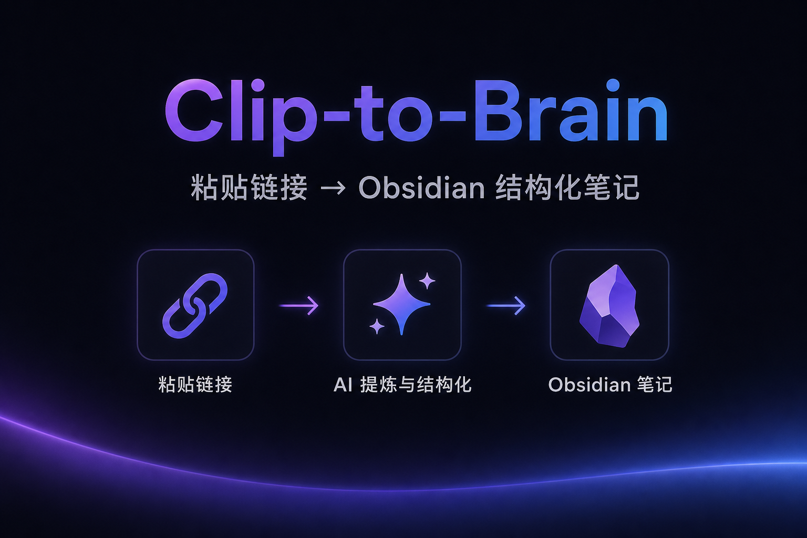
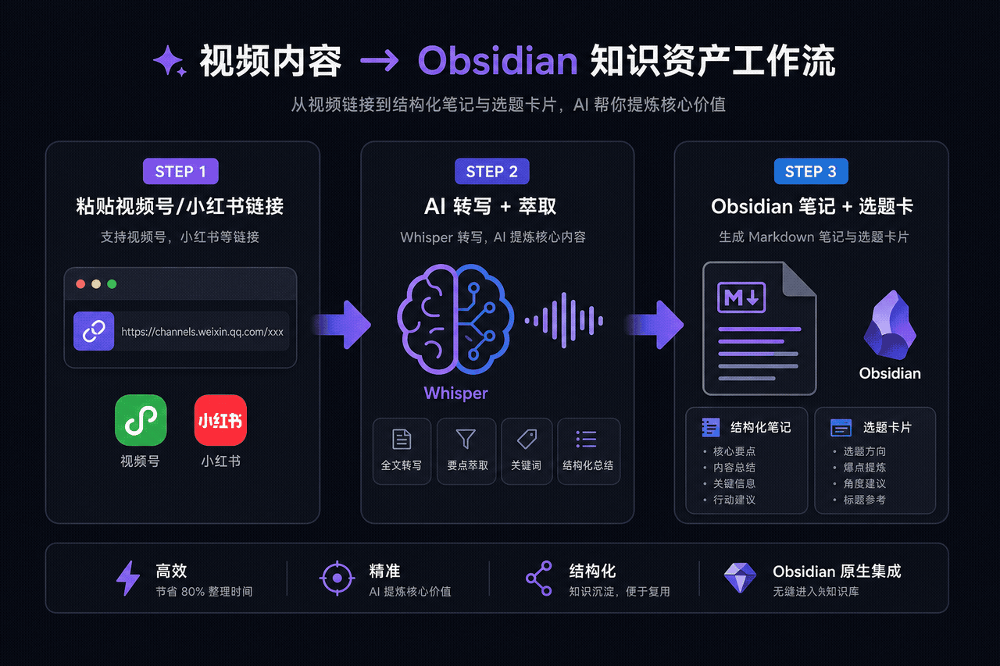
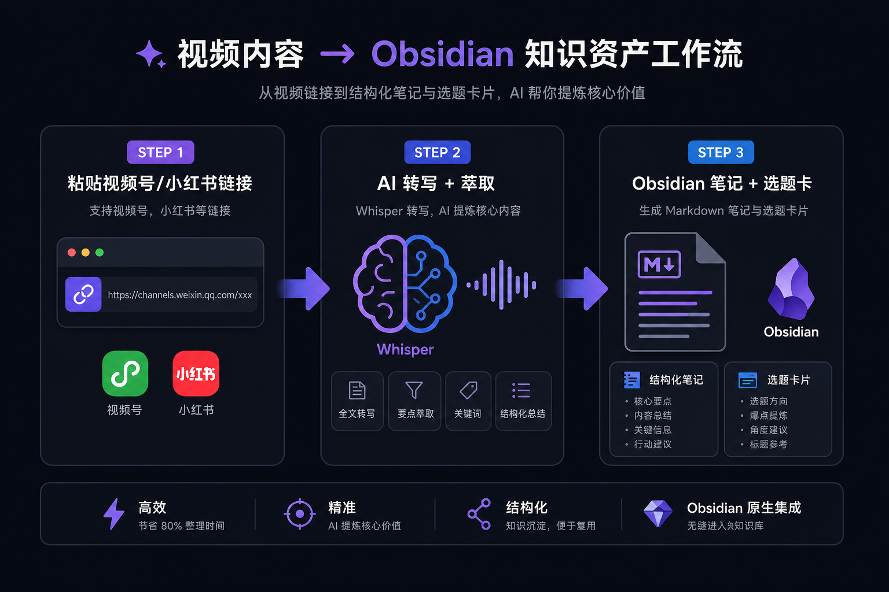
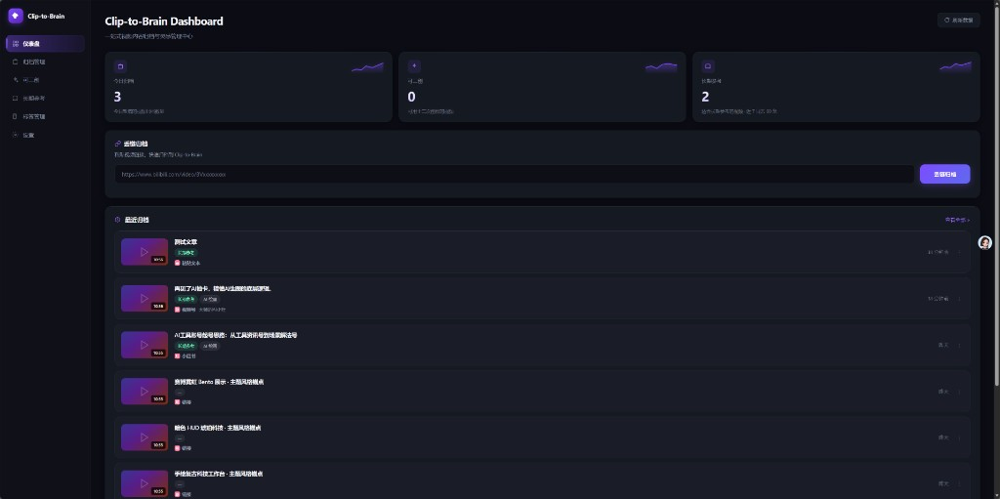
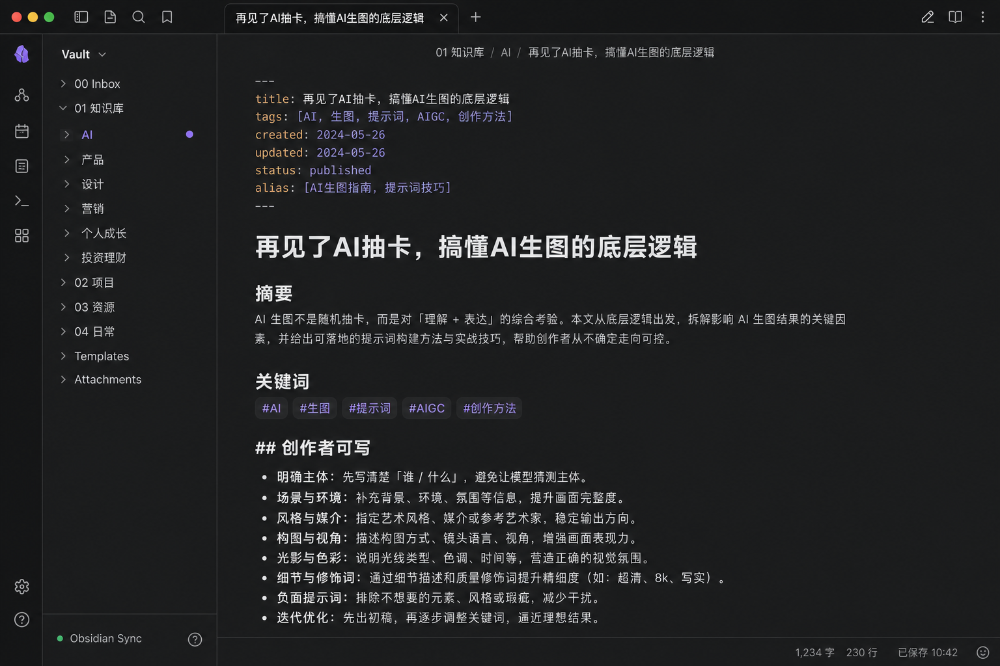

# Clip-to-Brain

**粘贴链接 → 结构化 Obsidian 笔记 + 可写角度 + 选题卡**

开源自托管。数据在本地，LLM 用你自己的 Key。





---

## 它能做什么

| 你丢进去 | 你拿到 |
|---------|--------|
| 视频号 / 小红书 / B站 / 抖音链接 | 转写 + 摘要 + 关键词 + 评级 |
| 微信公众号文章 | LLM 结构化萃取 |
| 长文纯文本 | 同上 |
| 任意 Profile 人设 | 「XXX可写」二创角度 + 选题卡 |



---

## 截图

<table>
<tr>
<td width="50%"><br/><sub>Web Dashboard · 链接归档 + 统计</sub></td>
<td width="50%"><br/><sub>Obsidian 笔记 · 摘要 + 可写角度</sub></td>
</tr>
</table>

---

## 5 分钟安装

### Windows

```powershell
git clone https://github.com/SlowVarLiang/clip-to-brain.git
cd clip-to-brain/clip-to-brain
.\setup.ps1
notepad ..\.env.local   # 填 LLM_API_KEY
cd ..\content-archiver-skill
.\clip.ps1 "https://weixin.qq.com/sph/..."
```

### macOS / Linux

```bash
git clone https://github.com/SlowVarLiang/clip-to-brain.git
cd clip-to-brain/clip-to-brain
chmod +x setup.sh && ./setup.sh
nano ../.env.local
cd ../content-archiver-skill && python scripts/clip.py "https://..."
```

### Docker

```bash
cp clip-to-brain/.env.example .env.local   # 填 LLM_API_KEY
cd clip-to-brain && docker compose up -d --build
open http://127.0.0.1:8765/clip/dashboard
```

详细文档见 [clip-to-brain/README.md](clip-to-brain/README.md)

---

## 推荐 LLM 配置

```env
LLM_API_KEY=sk-...
LLM_BASE_URL=https://api.deepseek.com/v1
LLM_MODEL=deepseek-chat
```

---

## 项目结构

```
clip-to-brain/           安装入口 + Docker
content-archiver-skill/  Clip 引擎 + Profiles + Vault 模板
video-parser/            80+ 平台解析 + REST API
video-to-knowledge-skill/ 视频转写
browser-extension/       Chrome 一键丢链
vault/                   setup 后生成的 Obsidian 库
```

---

## 可选能力

- **Telegram Bot**：`.\start-telegram.ps1`，直接发链接
- **Chrome 扩展**：`browser-extension/` 加载 unpacked
- **Profile 人设**：`default-creator` / `tutorial-blogger` / 自定义 YAML

```powershell
.\clip.ps1 -ListProfiles
.\clip.ps1 "<链接>" -Profile tutorial-blogger
```

---

## License

MIT — 见 [clip-to-brain/LICENSE](clip-to-brain/LICENSE)

---

## 发布

- [v0.1.0 Release Notes](clip-to-brain/RELEASE_v0.1.0.md)

云端托管版（Telegram 丢链 SaaS）后续单独提供。
